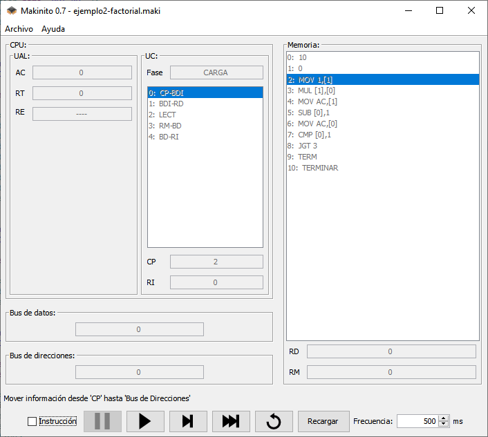
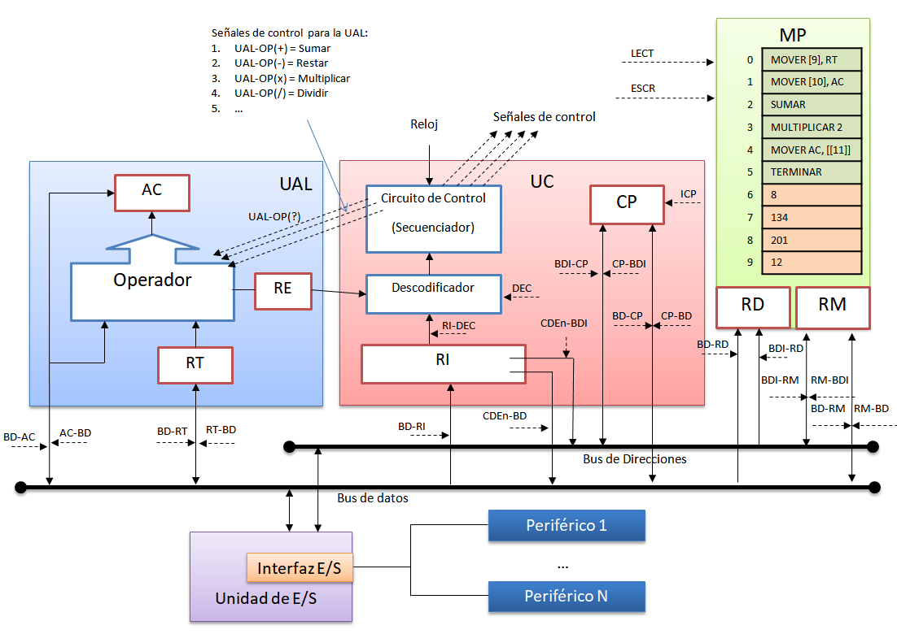
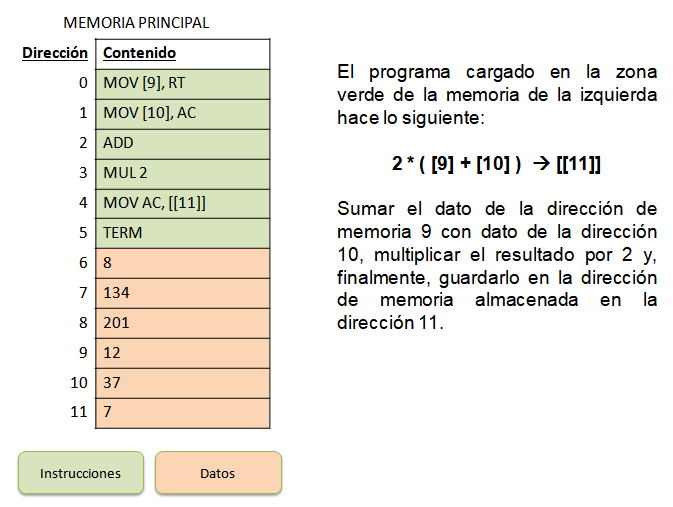

# Makinito

Makinito simula el comportamiento de una máquina con arquitectura Von Neumann. Su uso es únicamente con fines didácticos.

## Simulador



## Arquitectura

La arquitectura simulada por Makinito es la siguiente:



## Juego de instrucciones

Makinito cuenta con las siguientes instrucciones:

| Instrucción   | Descripción                                                  |
| ------------- | ------------------------------------------------------------ |
| `MOV x, y`    | Copia el valor de **x** en **y**                             |
| `ADD [x[,y]]` | Suma los valores **x** e **y** y guarda el resultado en **AC** |
| `SUB [x[,y]]` | Resta los valores **x** e **y** y guarda el resultado en **AC** |
| `MUL [x[,y]]` | Multiplica los valores **x** e **y** y guarda el resultado en **AC** |
| `DIV [x[,y]]` | Divide los valores **x** e **y** y guarda el resultado en **AC** |
| `CMP [x[,y]]` | Compara los valores **x** e **y** y modifica el registro de estados |
| `JMP d`       | Salta a la dirección de memoria **d**                        |
| `JE d`        | Salta a la dirección de memoria **d **si **x** es igual a **y** |
| `JLE d`       | Salta a la dirección de memoria **d **si **x** es menor o igual a **y** |
| `JGE d`       | Salta a la dirección de memoria **d **si **x** es mayor o igual a **y** |
| `JLT d`       | Salta a la dirección de memoria **d **si **x** es menor que **y** |
| `JGT d`       | Salta a la dirección de memoria **d **si **x** es mayor que **y** |
| `JNE d`       | Salta a la dirección de memoria **d **si **x** es distinto de **y** |
| `TERM`        | Detiene la máquina                                           |

> `x` e `y` pueden ser valores inmediatos, directos, indirectos o regisrtros (ver [modos de direccionamiento](#Modos-de-direccionamiento))

> `x[,y]`: Si no se especifica el 2º operando, se usa el registro **AC** por defecto.

> `[x, y]`: Si no se especifica ningún operando, se usan los registros **AC** y **RT** por defecto, respectivamente.

## Modos de direccionamiento

Makinito dispone de cuatro modos de direccionamiento de datos:

| Modo      | Descripción                                                  | Ejemplos                        |
| --------- | ------------------------------------------------------------ | ------------------------------- |
| Inmediato | El número es el dato                                         | 13 (dec), Dh (hex), 1101b (bin) |
| Directo   | El número entre corchetes es la dirección de memoria del dato | [13]                            |
| Indirecto | El número entre dobles corchetes es la dirección de memoria de la dirección de memoria del dato | [[13]]                          |
| Registro  | El dato está almacenado en un registro                       | RT, AC, RI, CP, ...             |

## Lenguaje ensamblador

Es posible escribir programas para Makinito en lenguaje ensamblador. 

Estos programas se componen de dos secciones o segmentos:

### Segmento de datos (DATA)

En el segmento de datos se declaran las variables, es decir, los espacios en memoria donde se guardan los datos que va a manipular el programa.

Este segmento está delimitado por `BEGIN-DATA` al comienzo y `END-DATA`al final.

```asm
BEGIN-DATA
	...
END-DATA
```

Las variables dentro de este segmento se declaran especificando el `NOMBRE` y el `VALOR`:

```asm
    NOMBRE=VALOR
```

El valor puede ser un número **decimal** (`10`), **hexadecimal** (`Ah`) o **binario** (`1010b`). Es posible usar `?` como valor si no queremos inicializar la variable al comienzo del programa.

:warning: Destacar que es necesario que todo lo que pongamos dentro del segmento de datos esté indentado mediante espacios en blanco o tabulados.

Un ejemplo de segmento de datos sería el siguiente:

```asm
BEGIN-DATA
	NUM1=10
	NUM2=Ah
	NUM3=1010b
	RES=?
END-DATA
```

### Segmento de código (CODE)

En este segmento escribimos las instrucciones que conforman nuestro programa. El formato de las instrucciones es el siguiente:

```asm
[ETIQUETA:]		MNEMONICO [OPERANDO1[,OPERANDO2]]
```

Las etiquetas son necesarias para las instrucciones de salto (JMP, JE, JNE, ...), de modo que si a una instrucciones de salto le indicamos que salte a una determinada etiqueta y cambiará el flujo de ejecución a la instrucción de la etiqueta o la que está justo a continuación.

El mnemónico se corresponde con una de las instrucciones del [juego de instrucciones](#Juego-de-instrucciones) de la arquitectura.

Los operandos son parámetros que pasamos a la instrucción, indicando así cuáles son los datos con los que queremos que opere. Los operandos se pueden expresar según los [modos de direccionamiento](#Modos-de-direccionamiento).

### Comentarios

Es posible comentar el código de un programa escrito en ensamblador de Makinito, para añadir aclaraciones o explicar algo.

Los comentarios son todas aquellas líneas que comienzan en `;` (punto y coma):

```asm
; esto es un comentario
```

También es posible escribir comentarios al final de un línea:

```asm
    MOVER 1,[FACT]    ; esto es otro comentario
```

Los comentarios son ignorados cuando el programa es cargado en Makinito.

### Programa de ejemplo

El siguiente programa de ejemplo calcula el factorial del número especificado en la variable `NUM` y guarda el resultado en la variable `FACT`:

```asm
; =============
; RES = !NUM
; =============

; segmento de datos
BEGIN-DATA
        NUM=10        ; número a calcular el factorial  
        FACT=?        ; donde se guarda el resultado
END-DATA

; segmento de código
BEGIN-CODE
        MOV 1,[FACT]
BUCLE:  MUL [FACT],[NUM]
        MOV AC,[FACT]
        SUB [NUM],1
        MOV AC,[NUM]
        CMP [NUM],1
        JGT BUCLE		
        TERM          ; se detiene la máquina
END-CODE
```

> Más ejemplos de programas en el siguiente [enlace](https://github.com/fvarrui/Makinito/tree/master/samples).

## Formato de las instrucciones

El formato de las instrucciones en código máquina para la arquitectura Makinito es el siguiente:


Donde:

* **CO** es el código de operación
* **MD1** es el modo de direccionamiento del primer operando
* **CDE1** es el campo de dirección efectiva del primer operando
* **MD2** es el modo de direccionamiento del segundo operando
* **CDE2** es el campo de dirección efectiva del segundo operando

El MD indica cómo recuperar el dato, y el significado del CDE dependerá del MD; es decir:

* si MD es **registro**, CDE es el identificador del registro que contiene el dato con el que se va a operar
* si MD es **inmediato**, CDE es el dato con el que se va a operar
* si MD es **directo**, CDE es la dirección en memoria del dato con el que se va a operar
* si MD es **indirecto**, CDE es la dirección en memoria de la dirección de memoria del dato con el que se va a operar

### Códigos de operación

| CO   | Valor | Binario |
| ---- | ----- | ------- |
| MOV  | 0     | 0000    |
| ADD  | 1     | 0001    |
| SUB  | 2     | 0010    |
| MUL  | 3     | 0011    |
| DIV  | 4     | 0100    |
| CMP  | 5     | 0101    |
| JMP  | 6     | 0110    |
| ...  | ...   | ...     |

### Codificación de los modos de direccionamiento

| MD         | Valor | Binario |
| ---------- | ----- | ------- |
| *Sin usar* | 0     | 000     |
| Inmediato  | 1     | 001     |
| Directo    | 2     | 010     |
| Indirecto  | 3     | 011     |
| Registro   | 4     | 100     |

### Codificación de los registros en el campo de dirección efectiva

| Registro | Valor | Binario  | Descripción             |
| -------- | ----- | -------- | ----------------------- |
| AC       | 0     | 00000000 | Registro acumulador     |
| RT       | 1     | 00000001 | Registro temporal       |
| RE       | 2     | 00000010 | Registro de estado      |
| RI       | 3     | 00000011 | Registro de instrucción |
| CP       | 4     | 00000100 | Contador de programa    |

### Ejemplos de codificación de instrucciones en código máquina

| Instrucción | CO   | MD1  | CDE1     | MD2  | CDE2     | Código máquina             |
| ----------- | ---- | ---- | -------- | ---- | -------- | -------------------------- |
| MOV 13,AC   | 0000 | 001  | 00001101 | 100  | 00000000 | 00000010000110110000000000 |
| ADD [7]     | 0001 | 010  | 00000111 | 000  | 00000000 | 00010100000011100000000000 |

## Ejemplo

Supongamos que hemos cargado en la memoria principal de Makinito el siguiente programa:



El segmento de código se ha cargado desde la dirección de memoria 0 a la 5, y el segmento de datos desde la 6 a la 11.

Makinito, para poder ejecutar cada una de las instrucciones de este programa, activa una secuencia de señales de control que hace que la máquina actúe para llevar a cabo la operación indicada. A continuación se muestra una tabla con la secuencia de señales de control correspondientes a cada instrucción:

| Señal de control | MOV [8],RT | MOV [9],AC | ADD        | MUL 2      | MOV AC,[10] |
| ---------------- | ---------- | ---------- | ---------- | ---------- | ----------- |
| 1                | CDE1-BDI   | CDE1-BDI   | UAL-OPT(+) | CDE1-BD    | AC-BD       |
| 2                | BDI-RD     | BDI-RD     |            | BD-RT      | BD-RM       |
| 3                | LECT       | LECT       |            | UAL-OPT(*) | CDE2-BDI    |
| 4                | RM-BD      | RM-BD      |            |            | BDI-RD      |
| 5                | BD-RT      | BD-AC      |            |            | ESCR        |

